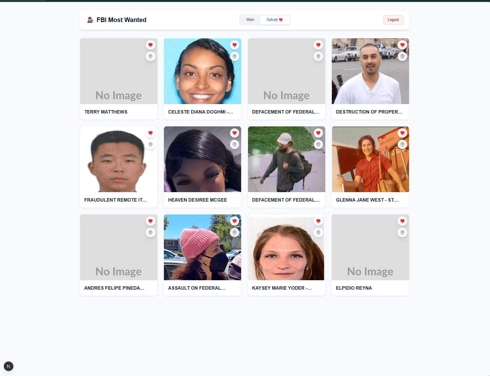

# 🕵️‍♂️ FBI Most Wanted - Intelligence Platform

O platformă modernă de urmărire și crowdsourcing pentru persoanele căutate de FBI, construită cu **.NET 8**, **Next.js 14** și **Real-time Websockets**.

 **

## 🚀 Funcționalități Cheie

* **🕵️‍♂️ Data Ingestion:** Background Service care preia automat datele de la FBI API și le sincronizează în PostgreSQL.
* **⚡ Real-Time Intel Feed:** Sistem bazat pe **SignalR** unde agenții primesc notificări live (vizuale și audio) când un coleg raportează o locație.
* **🗺️ Geospatial Intelligence:** Integrare cu **Leaflet Maps** pentru raportarea locațiilor suspecte + **Reverse Geocoding** automat.
* **🔐 Securitate Enterprise:** Autentificare prin **Keycloak (OAuth2/OIDC)** cu roluri separate (Admin/Agent).
* **📱 UI Modern:** Interfață React responsivă cu Tailwind CSS, Toast Notifications și Modale interactive.

## 🛠️ Tech Stack

### Backend (.NET 8)
* **Architecture:** Clean Architecture, Repository Pattern
* **Database:** Entity Framework Core + PostgreSQL
* **Real-time:** SignalR Hubs
* **Auth:** JWT Bearer + Keycloak Integration

### Frontend (Next.js 14)
* **Framework:** App Router, Server Components & Client Hooks
* **Styling:** Tailwind CSS
* **Maps:** React-Leaflet (OpenStreetMap)
* **State:** React Hooks + Optimistic Updates

## 🏗️ Arhitectură

```mermaid
graph TD
    User[💻 User Browser] -->|Next.js App| FE[Frontend Container]
    FE -->|REST API| BE[Backend .NET API]
    FE -->|WebSockets| Hub[SignalR Hub]
    BE -->|Read/Write| DB[(PostgreSQL)]
    BE -->|Sync| FBI[FBI Public API]
    FE -->|Auth| KC[Keycloak Server]
    BE -->|Validate Token| KC